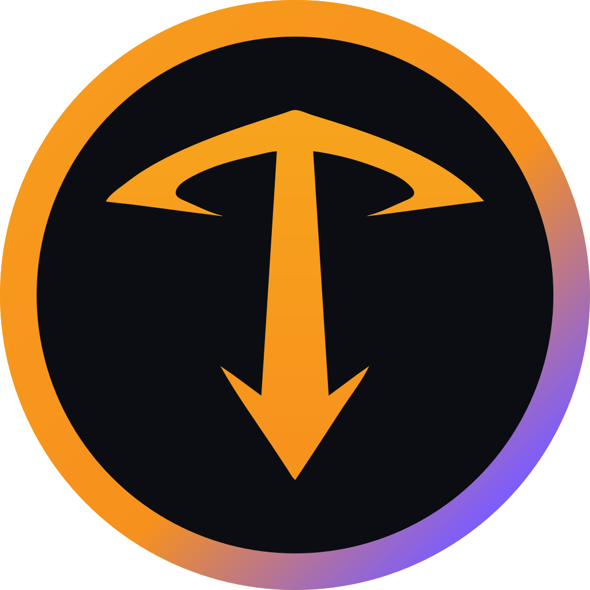
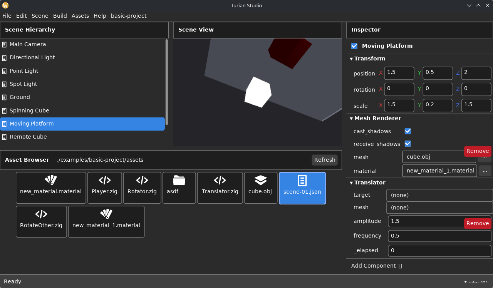

<div align="center">



# Turian Engine

**A component-based 3D game engine and editor built entirely in Zig.**

[](https://gitlab.com/mass4org/mega4/turian/-/commits/main)
[](https://gitlab.com/mass4org/mega4/turian/-/releases)
[](LICENSE)
[](https://ziglang.org/)

Turian gives you a Unity-style workflow — scene hierarchy, inspector, drag-and-drop asset management, and live script discovery — without the runtime overhead or licensing fees of commercial engines.

**[Website](https://turian.mass4.org) · [Download](https://gitlab.com/mass4org/mega4/turian/-/releases) · [Docs](https://turian.mass4.org/docs/) · [Discord](https://discord.com/channels/1104509879269457982/1384499574281867274) · [Matrix](https://matrix.to/#/!vRaFlDqBZyMXNRKDch:matrix.org)**

</div>

---

## Screenshots

| Turian Studio — editor + viewport |
|:---:|
|  |

---

## Install

### Download a binary release (recommended)

Download the latest SDK from the [Releases page](https://gitlab.com/mass4org/mega4/turian/-/releases).
You only need **[Zig 0.16.0](https://ziglang.org/download/)** — nothing else.

```bash
# Linux / macOS
tar xf turian-sdk-linux-x86_64-v0.1.0.tar.gz
export PATH="$PWD/turian-sdk-linux-x86_64-v0.1.0:$PATH"

# Windows (PowerShell)
Expand-Archive turian-sdk-windows-x86_64-v0.1.0.zip
$env:Path += ";$PWD\turian-sdk-windows-x86_64-v0.1.0"
```

Then create your first project:

```bash
turian-cli new-project my-game "My Game"
turian-cli build       my-game
```

See the [SDK guide](docs/sdk.md) for more details and the full CLI reference.

### Build from source

```bash
git lfs install
git clone https://gitlab.com/mass4org/mega4/turian.git && cd turian
zig build run          # compile + launch the editor
zig build test         # run all tests
```

See [docs/install.md](docs/install.md) for the full developer setup.

---

## Why Turian?

Most engines force a trade-off: the productivity of a visual editor **or** the control of a low-level systems language. Turian refuses the trade.

- **One language, top to bottom.** The engine, the editor, your game logic, and   the build tooling are all Zig. No VM, no scripting bridge, no FFI tax.
- **No garbage collector, no hidden allocations.** Your game ships as a single   native executable with predictable performance.
- **Editor-first, but never locked in.** Scenes are human-readable text you can   diff and merge; the CLI builds the exact same game headlessly for CI.
- **Free as in freedom.** GPLv3, no seats, no revenue share, no per-title fees.

---

## Component scripting

```zig
// assets/spinner.zig
const engine = @import("engine");

pub const Spinner = struct {
    pub const is_component = true;

    speed: f32 = 90.0,   // degrees / second — editable in inspector

    pub fn update(self: *Spinner, time: engine.Time) void {
        _ = self.speed * time.delta;
    }
};
```

Drop `spinner.zig` in your project's `assets/` folder. Turian discovers it automatically on the next **Refresh** and lists it under **Add Component ▾**.

---

## Documentation

| Guide | Description |
|-------|-------------|
| [Getting started](docs/getting-started.md) | Open a project, write a component, build a game |
| [Install / build from source](docs/install.md) | Developer setup |
| [SDK guide](docs/sdk.md) | Ship games without the engine checkout |
| [ADRs](docs/ADR/README.md) | Architecture decision records |

Full documentation is at **[turian.mass4.org/docs](https://turian.mass4.org/docs/)**.

---

## Community

- **Discord** — [#turian channel](https://discord.com/channels/1104509879269457982/1384499574281867274)
- **Matrix** — [#turian:matrix.org](https://matrix.to/#/!vRaFlDqBZyMXNRKDch:matrix.org)
- **Issues & MRs** — [GitLab](https://gitlab.com/mass4org/mega4/turian/-/issues)

Contributions are welcome. See [CONTRIBUTING.md](CONTRIBUTING.md).

---

## Sponsorship

Turian is developed and maintained by [Bruno Massa](https://mass4.org) and contributors.
If it saves you time or money, consider supporting the project:

[](https://www.patreon.com/c/MASS4)
[](https://ko-fi.com/mass4)

---

## License

Turian is free software, licensed under the **[GNU GPLv3](LICENSE)**.
Copyright © 2026 Bruno Massa.
