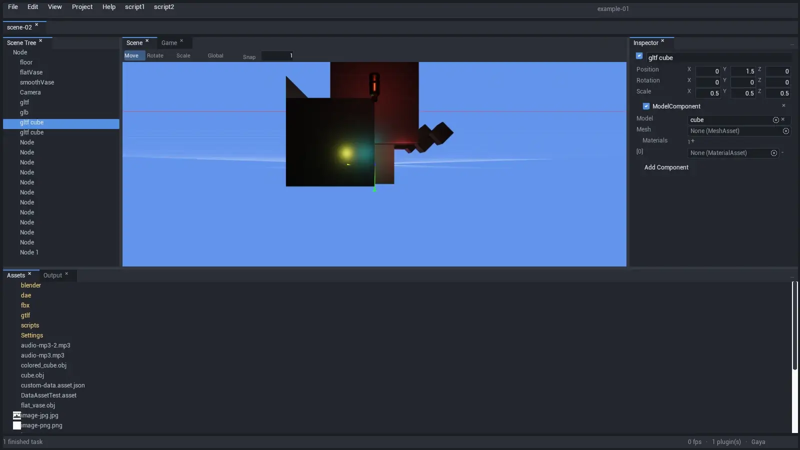
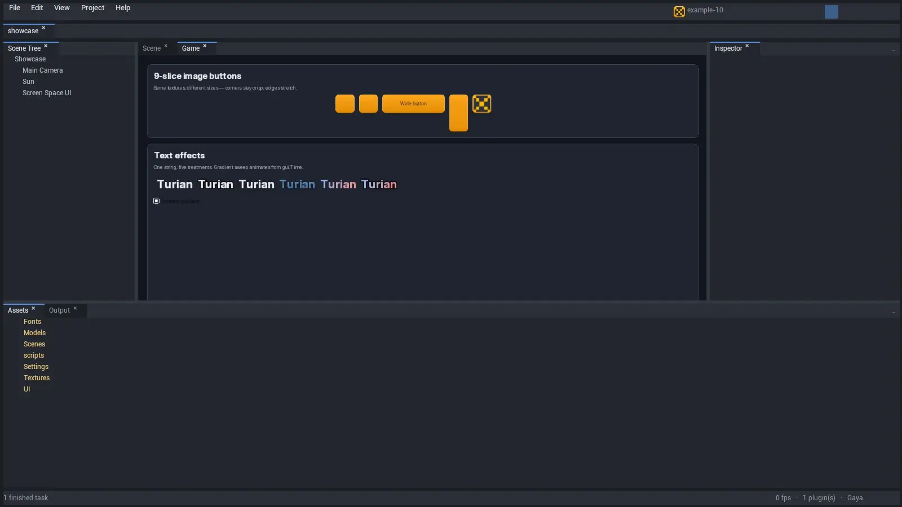

# Turian

**Turian** is a component-based 3D game engine for **.NET 10** and C#, with a Unity-style workflow. Its editor, Turian Studio, is built on the [Gaya](Gaya/) platform and drawn with [Guinevere](https://github.com/MASS4ORG/Guinevere).

- **[Website & documentation](https://turian.mass4.org)**
- **[Releases](https://github.com/MASS4ORG/Turian/releases)**
- **[Issues](https://github.com/MASS4ORG/Turian/issues)** and **[Milestones](https://github.com/MASS4ORG/Turian/milestones)**
- **[Discord](https://discord.com/channels/1104509879269457982/1384499574281867274)** and **[Matrix](https://matrix.to/#/!vRaFlDqBZyMXNRKDch:matrix.org)**



## Features

### Rendering
- **Vulkan 1.3** renderer (Silk.NET) with metal-roughness materials, plus point and directional lights.
- Modular render systems for PBR meshes, gizmos, and screen-space and world-space UI.
- **glTF 2.0**, FBX and OBJ model import, with textures, materials and localization string tables.

### Turian Studio



- Dockable scene tree, inspector, asset browser, scene view, game view and output panels.
- In-editor **Play Mode** on a copy of the scene; scripts recompile and hot-swap while the editor runs.
- Build & Run and one-click **Export** to a standalone, self-contained executable.
- Themes, localization and customizable keyboard shortcuts.

### Engine
- Node/component scene graph, prefabs, data assets and stable, rename-proof serialization.
- Input actions, localization, immediate-mode game UI with `.ui` documents and `.uss` style sheets.
- **OAP** (Open Asset Package) archives for shipping game content.

### Tooling
- **`turian-cli`**: create, compile, export, play and diagnose projects headlessly, and a container image (`ghcr.io/mass4org/turian-cli`) for your own CI/CD.

## Install

Turian Studio and the CLI compile your game's C# scripts, so they need the **[.NET 10 SDK](https://dotnet.microsoft.com/download/dotnet/10.0)** and a Vulkan 1.3 capable GPU driver.
Download from the [latest release](https://github.com/MASS4ORG/Turian/releases/latest):

| Platform | Package | Notes |
| --- | --- | --- |
| Windows | `Turian-<version>-win-x64-setup.exe` | Per-user install, no admin rights. Adds `turian-studio` and `turian-cli` to your `PATH` and a Start menu entry. |
| Debian / Ubuntu | `turian-common_…deb`, `turian-cli_…deb`, `turian-studio_…deb` | `sudo apt install ./turian-*.deb` installs both tools into `/usr/bin`. |
| Linux (other) | `Turian-<version>-linux-x64.zip` | Extract anywhere and add the folder to your `PATH`. |

Exported games are self-contained: players do not need .NET installed.

## Quick start

```sh
turian-cli new MyGame          # scaffold a project with a starter scene
turian-studio --project MyGame # open it in the editor
turian-cli export MyGame       # build a standalone game into MyGame/Output
```

The same steps are available in Studio: **File → New Project…**, **Project → Export**.
See [Getting started](docs/Getting-started.md) for a walkthrough, and [Building from source](docs/Building-from-source.md) to work on the engine itself.

## Contributing

Contributions are welcome. Read the [contributing guidelines](docs/CONTRIBUTING.md) before opening a pull request.

## Supporting the project

Turian is an independent project. If you find it valuable, consider supporting its development on [Patreon](https://www.patreon.com/c/MASS4) or [Ko-fi](https://ko-fi.com/mass4).

## License

Turian is licensed under the [Mozilla Public License 2.0](LICENSE.md), the same license as **Firefox**. Games you make with Turian are yours, under any license you choose; only changes to the engine's own files are shared back. See the [license page](https://turian.mass4.org/docs/about/license/) for details.
